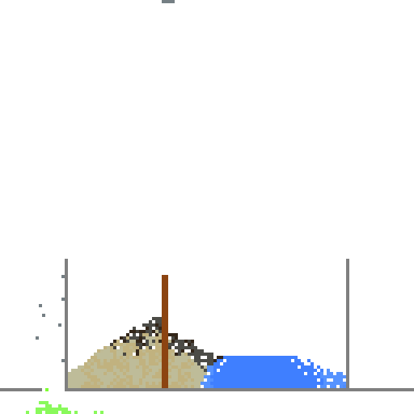
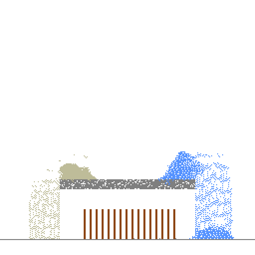
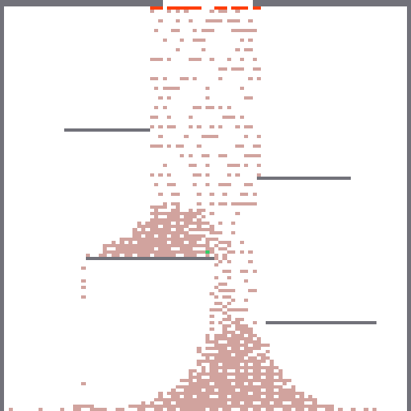

# CellularFX

[](https://godotengine.org)
[]()
[](LICENSE)

一款面向 Godot 4 的高性能**元胞自动机 / 落沙引擎**，使用 C++ 编写 GDExtension，并支持可选的 GPU 计算加速。

[English README](README.md)

---

## 特性

- **双后端**：运行时可在 CPU 与 GPU 模拟之间切换。
  - CPU 后端：活跃区域扫描 + 热传导/相变多线程并行。
  - GPU 后端：Vulkan Compute Shader，push 模式移动 + atomic claim 竞争解决。
- **材料系统**：以 Godot `Resource` 资源定义材料，支持物理与反应规则。
  - 内置材料类型：固体、粉末、液体、气体。
  - 行为：重力下落、斜向滑落、水平流动、基于密度的液体置换。
  - 反应规则：寿命/衰变、可燃/燃烧、腐蚀、爆炸。
- **大网格**：高效模拟 256×256 到 1024×1024 规模的世界。
- **运行时 API**：通过 GDScript 初始化、更新、绘制、清空、切换后端。
- **编辑器友好**：可直接在 Godot 编辑器中使用；材料可在 Inspector 中配置。
- **编辑器 Dock**：笔刷工具、材料面板、实时预览、播放/步进/清空控制。
- **温度可视化**：单元格颜色会随自身温度向热/冷色调插值。
- **性能基准**：`demo/benchmark.gd` 测量 CPU 性能；`demo/benchmark_gpu.gd` 在窗口化环境下对比 CPU/GPU。

## 截图



*128×128 世界：沙堆、水洼、木塔、燃油火焰与酸液腐蚀。*



*256×256 世界：洞穴地形、水流与蔓延的森林火灾。*



*岩浆逃生：使用 CellularFX 制作的小游戏。躲避下落的岩浆，逃向顶部出口。*

## 性能参考

以下数据在 AMD Ryzen 核显笔记本、Windows 11、Godot 4.6.2、MSVC release 构建下测得，仅供参考，实际性能因硬件而异。

### CPU 后端（headless）

运行命令：`godot --headless --script demo/benchmark.gd`

| 尺寸 | 粒子数 | ms/帧 | FPS |
|------|--------|-------|-----|
| 64×64 | 约 2 300 | 0.13 | 约 7 400 |
| 128×128 | 约 9 400 | 0.29 | 约 3 300 |
| 256×256 | 约 37 700 | 0.99 | 约 1 000 |
| 512×512 | 约 151 000 | 3.64 | 约 275 |

### GPU vs CPU（窗口化）

运行命令：`godot --script demo/benchmark_gpu.gd`

| 尺寸 | 后端 | 粒子数 | ms/帧 | FPS |
|------|------|--------|-------|-----|
| 64×64 | CPU | 4 096 | 0.20 | 约 5 000 |
| 64×64 | GPU | 4 096 | 0.41 | 约 2 400 |
| 128×128 | CPU | 16 384 | 0.57 | 约 1 800 |
| 128×128 | GPU | 16 384 | 0.83 | 约 1 200 |
| 256×256 | CPU | 65 536 | 1.81 | 约 550 |
| 256×256 | GPU | 65 536 | 1.69 | 约 590 |

## 支持平台

| 平台 | 状态 | 说明 |
|---|---|---|
| Windows | ✅ 已测试 | 必须使用 MSVC ABI（见构建说明） |
| Linux | 🚧 计划中 | |
| macOS | 🚧 计划中 | |
| Android / Web | 🚧 未来 | |

## 安装

### 方式一：Godot 资源平台（推荐，发布后）

在 Godot 资源平台搜索 **"CellularFX"** 并安装到项目。

### 方式二：手动安装

1. 从 [Releases](https://github.com/xy200303/CellularFX/releases) 下载最新版本。
2. 将 `addons/cellular_automata_engine/` 文件夹复制到你的 Godot 项目中。
3. 在 **项目 → 项目设置 → 插件 → CellularFX** 中启用插件。

## 版本下载

按版本列出的插件包直链（用于 Godot 资源平台或手动安装）：

| 版本 | 下载 |
|------|------|
| v0.1.0 | [cellular_automata_engine.zip](https://raw.githubusercontent.com/xy200303/CellularFX/bdcd63c42804a3f657c2d37841715f82f21ce886/cellular_automata_engine.zip) |

## 快速开始

```gdscript
extends Node2D

@onready var world: CASWorld = $CASWorld

func _ready():
    # 可选：在 init() 前切换到 GPU 后端
    world.set_backend(CASWorld.BACKEND_GPU)
    world.init(256, 256)

    # 注册材料
    var sand := CASMaterial.new()
    sand.material_name = "sand"
    sand.material_type = CASMaterial.TYPE_POWDER
    sand.material_color = Color(0.76, 0.70, 0.50)
    sand.density = 5
    world.register_material(sand)

    var water := CASMaterial.new()
    water.material_name = "water"
    water.material_type = CASMaterial.TYPE_LIQUID
    water.material_color = Color(0.25, 0.50, 1.0)
    water.density = 3
    world.register_material(water)

    var stone := CASMaterial.new()
    stone.material_name = "stone"
    stone.material_type = CASMaterial.TYPE_SOLID
    stone.material_color = Color(0.5, 0.5, 0.5)
    stone.density = 10
    world.register_material(stone)

    # 放置一些沙子
    world.set_cell(128, 10, "sand")

func _process(_delta):
    world.update()
```

## API 参考

### CASWorld

| 方法 | 说明 |
|---|---|
| `init(width, height)` | 创建模拟网格。 |
| `set_backend(backend)` | `BACKEND_CPU` 或 `BACKEND_GPU`，需在 `init()` 前调用。 |
| `get_backend_name()` | 返回 `"CPU"` 或 `"GPU"`。 |
| `register_material(material)` | 注册一个 `CASMaterial` 资源。 |
| `set_cell(x, y, material_name)` | 在指定位置放置材料。 |
| `get_cell(x, y)` | 获取指定位置的材料名称。 |
| `update()` | 推进一帧模拟。 |
| `clear()` | 清空世界。 |
| `get_texture()` | 获取渲染用的 `Texture2D`。 |
| `get_particle_count()` | 获取非空单元格数量。 |
| `save_world(path)` | 将世界保存为二进制文件。 |
| `load_world(path)` | 从二进制文件加载世界。 |

### CASMaterial

| 属性 | 类型 | 说明 |
|---|---|---|
| `material_name` | `String` | 唯一材料标识。 |
| `material_type` | `int` | `TYPE_SOLID`、`TYPE_POWDER`、`TYPE_LIQUID`、`TYPE_GAS`。 |
| `material_color` | `Color` | 显示颜色。 |
| `density` | `int` | 同类型液体之间的置换依据。 |
| `lifetime` | `int` | 单元存活帧数（`0` 为无限）。 |
| `decay_to` | `String` | 寿命耗尽后转变的材料名称。 |
| `flammable` | `bool` | 与高温材料相邻时会燃烧。 |
| `burn_to` | `String` | 燃烧后转变的材料名称。 |
| `corrosive` | `bool` | 会腐蚀相邻的非腐蚀性材料。 |
| `corrosion_residue` | `String` | 腐蚀后留下的残留材料名称。 |
| `corrosion_chance` | `float` | 每帧腐蚀邻居的概率（0-1）。 |
| `explosive` | `bool` | 与高温材料相邻时会爆炸。 |
| `explode_to` | `String` | 爆炸后 3×3 区域替换为的材料名称。 |
| `temperature` | `int` | 单元格默认温度。 |
| `emit_light` | `bool` | 是否使用 `glow_color`。 |
| `glow_color` | `Color` | 自发光/色调颜色。 |
| `melting_point` | `int` | 超过此温度时变为 `liquid_form`。 |
| `boiling_point` | `int` | 超过此温度时变为 `gas_form`。 |
| `freeze_point` | `int` | 低于此温度时变为 `solid_form`。 |
| `solid_form` | `String` | 凝固后转变的材料名称。 |
| `liquid_form` | `String` | 熔化后转变的材料名称。 |
| `gas_form` | `String` | 沸腾后转变的材料名称。 |
| `thermal_conductivity` | `int` | 0–100，数值越高热传导越快。 |

## 后端说明

- **GPU 后端**需要带 GPU 的窗口化 Godot 进程。在 `--headless` 模式下会自动回退到 CPU。
- GPU 使用 Vulkan 计算着色器，采用 push 模式移动：每个单元格提议目标位置，通过 atomic `CompSwap` 解决冲突，再经 resolve/clear pass 完成位置确定；最后的 pass 执行反应、寿命衰减、热传导与相变。
- CPU 使用活跃区域扫描以跳过空区域；移动/反应保持单线程时序，热传导/相变按水平 band 多线程并行。

## 从源码构建

### 环境要求

- Godot 4.2+（Windows 官方二进制使用 MSVC 构建）
- Python 3 + SCons
- Visual Studio 2022 及 C++ 工作负载（Windows）
- 已初始化的 Git 子模块

### 步骤

```bash
git clone --recursive https://github.com/xy200303/CellularFX.git
cd cellularfx
scons platform=windows target=template_debug arch=x86_64 build_profile=build_profile.json -j4
```

> ⚠️ **重要**：在 Windows 上必须使用 **MSVC**，不能用 MinGW，因为 Godot 官方 Windows 二进制是 MSVC ABI，GDExtension 必须 ABI 匹配。

### 编辑器打开很慢？

如果你直接在 Godot 编辑器中打开源码仓库，首次文件扫描可能会很慢，因为 `godot-cpp/` 子模块包含数千个头文件和生成的源码文件，编辑器打开时会扫描整个 `res://` 树。

解决方案：

1. **使用发布版插件包**（`cellular_automata_engine.zip`）。它只包含插件文件和预编译 DLL，在空 Godot 项目中打开很快。
2. **开发时把 godot-cpp 移到项目树外**：
   ```bash
   mv godot-cpp ../godot-cpp
   set GODOT_CPP_PATH=..\godot-cpp
   scons -j8 target=template_debug
   ```
   这样可以把庞大的子模块排除在 Godot 文件扫描之外。
3. 等待首次扫描完成；后续打开会复用 `.godot/` 导入缓存，速度会快很多。

## 项目结构

```text
cellularfx/
├── addons/cellular_automata_engine/   # 插件文件、GDExtension 配置、图标、着色器
├── demo/                              # 示例场景与测试
├── src/
│   ├── api/                           # CASWorld、CASMaterial（面向 GDScript）
│   ├── core/                          # Cell、WorldGrid、MaterialRegistry、ISimulator
│   ├── cpu/                           # CPUSimulator
│   └── gpu/                           # GPUSimulator + 计算着色器
├── godot-cpp/                         # godot-cpp 子模块
├── build_profile.json                 # 裁剪后的 godot-cpp API，加速构建
├── SConstruct
└── README.md
```

## 路线图

- [x] GDExtension 骨架与 MSVC 构建
- [x] CPU 后端 MVP
- [x] CPU 活跃区域优化
- [x] GPU 计算后端
- [x] 更多材料与反应规则（火、烟、酸、油、木头、火药）
- [x] 数据驱动的材料规则（寿命、燃烧、腐蚀、爆炸）
- [x] 多线程 CPU 后端
- [x] 编辑器插件（笔刷、材料面板、保存/加载）
- [x] 世界序列化
- [ ] Linux 与 macOS 支持
- [ ] 视觉效果（发光、扭曲、粒子）

## 许可证

[MIT License](LICENSE)

## 致谢

基于 [godot-cpp](https://github.com/godotengine/godot-cpp) 构建。
